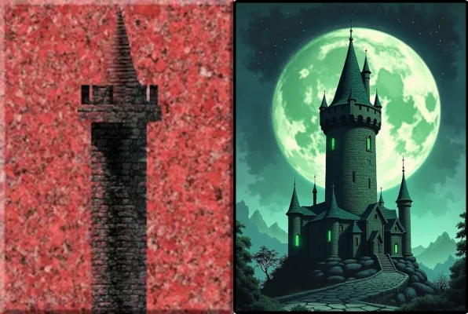

# Arcomage HD Alt Art

This is fork of the "Arcomage HD" by Tom Chen with my alternative art.

I don't try to exactly redraw the original cards. The main thing is that they correspond to the meaning and look nice. But I try to be cannonical.

Although my fork does not fully correspond to the canon, I think the new version of the cards looks much more interesting.

The card images replacing is in progress, although not all the cards have been replaced yet. 

Play Arcomage Alt Art
-
You already can play the Arcomage game with new cards in browser by the following link:

https://korchy.github.io/arcomage-hd/

Replacing art process
-
I'm publishing the process of creating alternative art in my Telegram channel:

https://t.me/ArtCards_Interplanety

Alternative art
-
Examples of art replacing:

 
 
 
 

Original Arcomage HD by Tom Chen
-
Here is the original game source files:

https://github.com/arcomage/arcomage-hd
