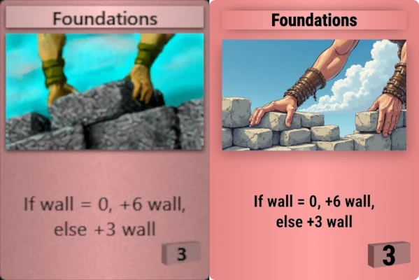
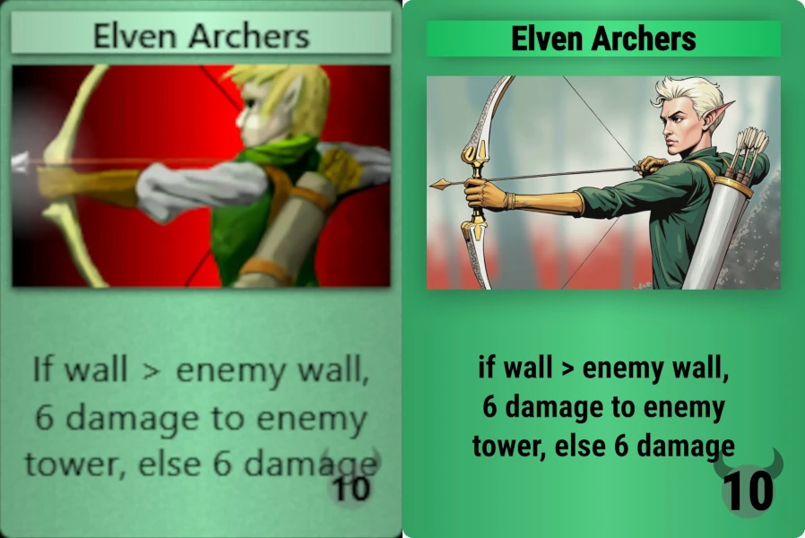
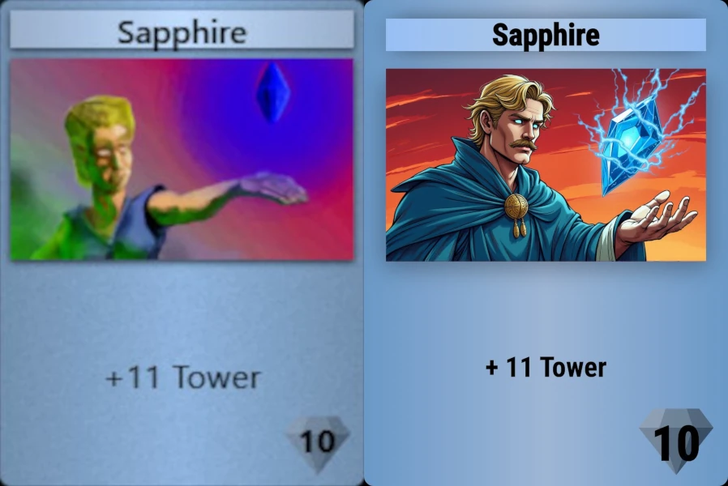

# Arcomage HD Alt Cards

This is fork of the "Arcomage HD" by Tom Chen with my alternative card images.

I don't try to exactly redraw the original maps. The main thing is that they correspond to the meaning and look nice.

Although my fork does not fully correspond to the canon, I think the new version of the maps looks much more interesting.

The card images replacing is in progress, although not all the cards have been replaced yet. 

You already can play the Arcomage game with new cards in browser by the following link:

https://korchy.github.io/arcomage-hd/

Examples of cards replacing:

 
 
 

Source Files by Tom Chen
-
Here is the original game source files:

https://github.com/arcomage/arcomage-hd
